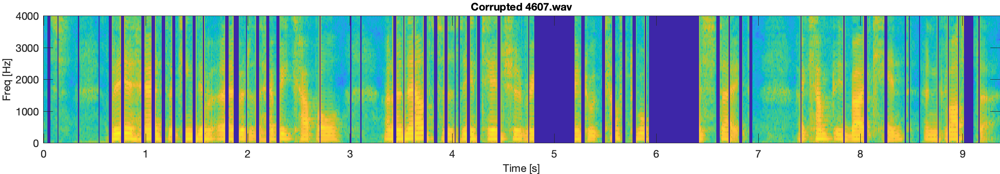
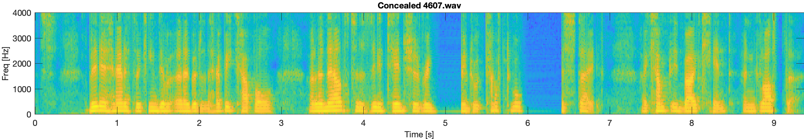
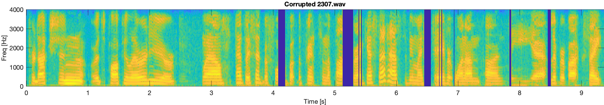
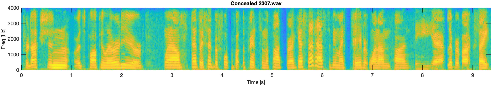
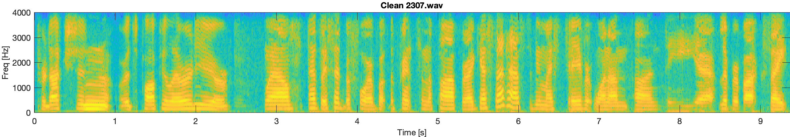
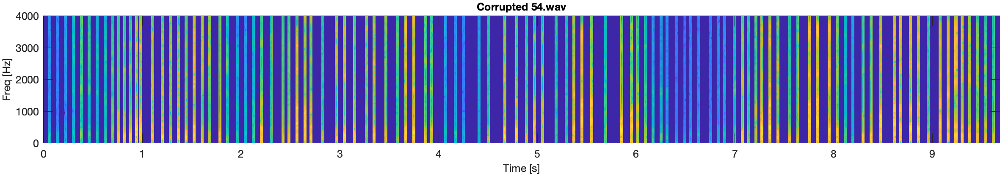
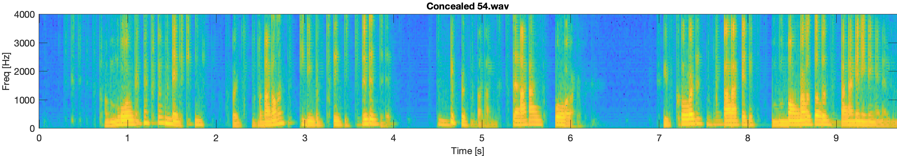
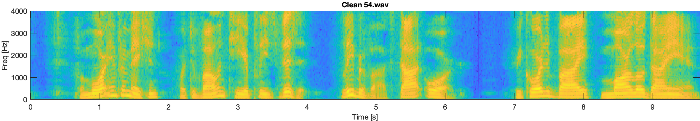

# tPLCnet: Real-time Deep Packet Loss Concealment in the Time Domain Using a Short Temporal Context

## Audiosamples:
 If you are looking at the README.md directly on GitHub, go this [webpage](https://breizhn.github.io/tPLCnet/) to listen to the audio samples.

---

### 4607.wav

<audio src="audio_samples/corrupted/4607.wav" controls preload></audio>

<audio src="audio_samples/improved/4607.wav" controls preload></audio>

<audio src="audio_samples/clean/4607.wav" controls preload></audio>

---

### 2307.wav

<audio src="audio_samples/corrupted/2307.wav" controls preload></audio>

<audio src="audio_samples/improved/2307.wav" controls preload></audio>

<audio src="audio_samples/clean/2307.wav" controls preload></audio>

---

### 54.wav

<audio src="audio_samples/corrupted/54.wav" controls preload></audio>

<audio src="audio_samples/improved/54.wav" controls preload></audio>

<audio src="audio_samples/clean/54.wav" controls preload></audio>

