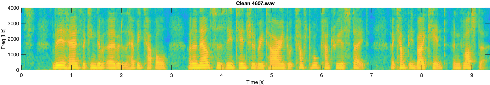
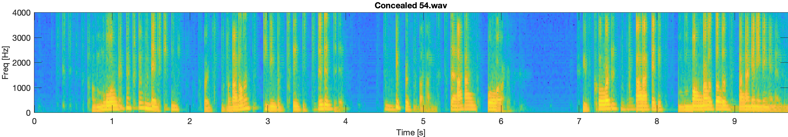
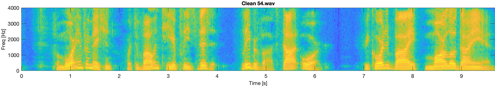

# tPLCnet: Real-time Deep Packet Loss Concealment in the Time Domain Using a Short Temporal Context

## Paper Preprint:
The paper can be found on arXiv [here](https://arxiv.org/abs/2204.01300).

## Audio Samples:

### 4607.wav

<audio src="audio_samples/corrupted/4607.wav" controls preload></audio>

<audio src="audio_samples/improved/4607.wav" controls preload></audio>

<audio src="audio_samples/clean/4607.wav" controls preload></audio>

---

### 2307.wav

<audio src="audio_samples/corrupted/2307.wav" controls preload></audio>

<audio src="audio_samples/improved/2307.wav" controls preload></audio>

<audio src="audio_samples/clean/2307.wav" controls preload></audio>

---

### 54.wav

<audio src="audio_samples/corrupted/54.wav" controls preload></audio>

<audio src="audio_samples/improved/54.wav" controls preload></audio>

<audio src="audio_samples/clean/54.wav" controls preload></audio>

---
## Video Presentation:
<iframe width="560" height="315" src="https://www.youtube-nocookie.com/embed/phJAUK3QxOk" title="YouTube video player" frameborder="0" allow="accelerometer; autoplay; clipboard-write; encrypted-media; gyroscope; picture-in-picture" allowfullscreen></iframe>

